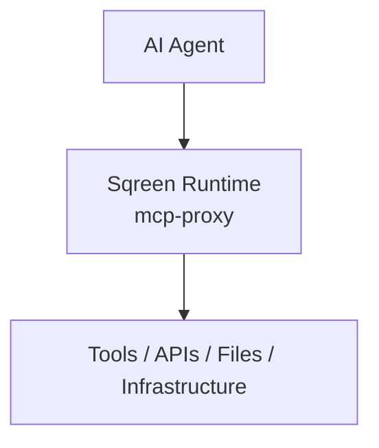
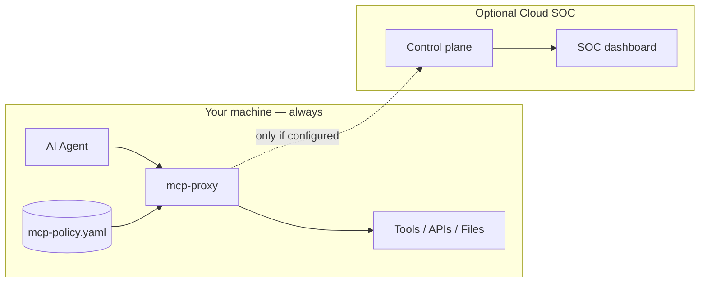
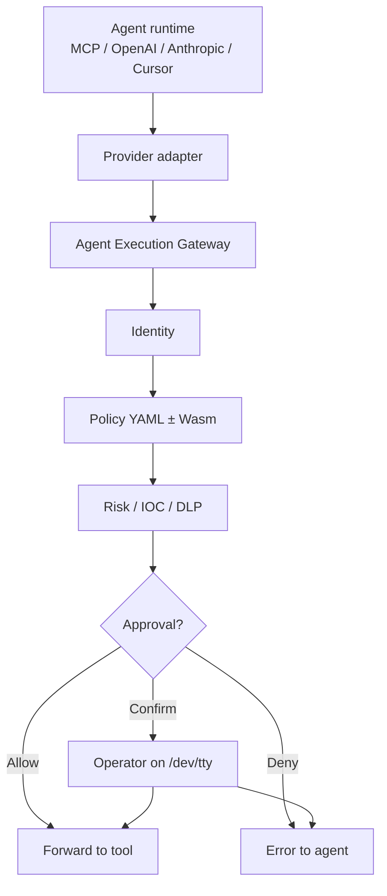

# Sqreen

**Local runtime enforcement for intercepted AI agent tool calls.**

Sqreen sits between an AI agent and the tools it wants to use — files, shells, APIs, MCP servers — and applies a YAML policy **before** the action runs.

```text
AI Agent
    ↓
Sqreen (mcp-proxy)
    ↓
Tools / APIs / Files / Infrastructure
```



| | |
|---|---|
| **Install / quickstart** | [docs/QUICKSTART.md](docs/QUICKSTART.md) · `curl -fsSL https://sqreen.ai/install.sh \| bash` |
| **Aha moment** | `source ~/.config/mcp-proxy/env && mcp-proxy demo` |
| **Health** | `mcp-proxy status` · `mcp-proxy doctor` |
| **Privacy** | [docs/PRIVACY.md](docs/PRIVACY.md) — prompts/files stay local by default |
| **Security** | [SECURITY.md](SECURITY.md) · [Threat model](docs/THREAT_MODEL.md) · `security@sqreen.ai` |
| **License** | [MIT](LICENSE) (edge runtime); Cloud SOC is separate / commercial |


---

## Why AI-agent runtime security matters

Prompt instructions (“don’t read secrets”) are soft. Agents still call tools. A compromised prompt, a confused model, or a malicious MCP server can request private keys, cloud credentials, or destructive shell commands.

Sqreen enforces policy **at the tool-call boundary** — after the model decides what to do, before the tool runs. That is independent of the model vendor and does not rely on the prompt complying.

## Protection boundary

| Protected | Not covered |
|-----------|-------------|
| MCP `tools/call` via stdio wrap (`mcp-proxy -- run …`) | Model prompts / chat buffers themselves |
| OpenAI-compatible & Anthropic-shaped HTTP tool loops (`mcp-proxy serve`) | IDE chat that never goes through MCP/HTTP wrap |
| Policy deny / redact / confirm on intercepted actions | OS processes, IAM, network firewalls |

Details: [docs/PRIVACY.md](docs/PRIVACY.md) · `mcp-proxy status`.

## What Sqreen protects

| Surface | Examples |
|---------|----------|
| **Filesystem** | `read_file` and similar tools; credential / private-key path patterns from policy |
| **Shell / commands** | High-risk patterns; optional operator approval (`Confirm`) |
| **MCP tool calls** | JSON-RPC `tools/call` on stdin/stdout |
| **HTTP agent tool loops** | OpenAI-compatible and Anthropic Messages API tool calls via local `serve` |
| **Secrets in transit** | DLP redaction of common API-key / token shapes (when enabled by policy / gateway) |

It does **not** replace IAM, network firewalls, or model-provider safety filters. It is an additional control point on the agent’s tool path.

## Supported runtimes

| Runtime | How Sqreen attaches |
|---------|---------------------|
| **MCP** (Cursor, Claude Desktop, …) | Stdio wrap: `mcp-proxy -- run <mcp-server …>` |
| **OpenAI-compatible HTTP** | `mcp-proxy serve` + `OPENAI_BASE_URL` |
| **Anthropic Messages API** | `mcp-proxy serve` + Anthropic base URL |
| **Cursor / Claude Code** | Installer can patch IDE MCP config; optional project hooks |
| **Generic / custom** | Adapter framework — see [docs/PROVIDER_ADAPTERS.md](docs/PROVIDER_ADAPTERS.md) |

Shipped adapter ids today: `mcp`, `openai`, `anthropic`, `cursor`, `claude_code`, `generic`. Others are planned, not claimed as shipped.

---

## Install

```bash
curl -fsSL https://sqreen.ai/install.sh | bash
source ~/.config/mcp-proxy/env   # PATH + MCP_POLICY_PATH
mcp-proxy demo                   # allow → block → confirm → explain
mcp-proxy status && mcp-proxy doctor
```

Full path: **[docs/QUICKSTART.md](docs/QUICKSTART.md)**. Design partners: [docs/DESIGN_PARTNER.md](docs/DESIGN_PARTNER.md) · [docs/PILOT_CHECKLIST.md](docs/PILOT_CHECKLIST.md).

Prebuilt archives are authenticated with an **Ed25519-signed** `release-manifest.json` and per-artifact SHA-256 digests before install ([docs/RELEASE_INTEGRITY.md](docs/RELEASE_INTEGRITY.md)). OpenSSL 3 is required for signature verification. Pin with `bash -s -- --version v0.1.9` if needed.

- Prebuilt binaries: [sqreen.ai/releases](https://sqreen.ai/releases/latest/mcp-proxy-darwin-aarch64.tar.gz)
- From source: `cd mcp-proxy && cargo build --release` (also builds `sqreen` alias)
- Uninstall: `mcp-proxy/scripts/uninstall.sh` (add `--purge` to remove `~/.config/mcp-proxy`)

Full CLI notes: [mcp-proxy/README.md](mcp-proxy/README.md).

Enforcement benchmarks (latency / throughput baselines): [docs/BENCHMARKS.md](docs/BENCHMARKS.md).

Adversarial security tests (cross-runtime equivalence + attack attempts): [docs/ADVERSARIAL_TESTS.md](docs/ADVERSARIAL_TESTS.md).

## Protect your first agent

### 1) See enforcement (no real secrets)

```bash
mcp-proxy demo
```

Uses **synthetic paths only** (a safe temp file is allowed; a fake credential-shaped path is blocked; Confirm is simulated) and prints **why**. No real secrets or destructive commands.

### 2) Wrap MCP (Cursor / Claude)

Installer may patch `mcp.json` automatically. Manual shape:

```json
{
  "mcpServers": {
    "filesystem": {
      "command": "/Users/YOU/.local/bin/mcp-proxy",
      "args": ["--", "run", "npx", "-y", "@modelcontextprotocol/server-filesystem", "."],
      "env": {
        "MCP_POLICY_PATH": "/Users/YOU/.config/mcp-proxy/mcp-policy.yaml"
      }
    }
  }
}
```

Restart the IDE, then ask the agent to read a normal project file (allowed) vs a credential-shaped path matching the default policy (blocked).

### 3) Shield an OpenAI-compatible SDK

```bash
mcp-proxy serve --listen 127.0.0.1:8787 --upstream https://api.openai.com
export OPENAI_BASE_URL=http://127.0.0.1:8787/v1
```

Anthropic: same `serve` with `--upstream https://api.anthropic.com`, then point the SDK base URL at `http://127.0.0.1:8787`.

---

## What a policy looks like

Default file: `~/.config/mcp-proxy/mcp-policy.yaml` (seeded by the installer). Full defaults live in `mcp-proxy/mcp-policy.yaml`.

```yaml
version: "1"
global:
  risk_threshold: 70
  block_patterns:
    # Seeded defaults also cover common private-key and cloud-credential paths
    - "secret_store/"
tools:
  - name: "read_file"
    action: "Allow"
    block_patterns: ["secret_store/"]
  - name: "execute_bash"
    action: "Confirm"   # prompt on the Runtime TTY before running
    block_patterns: ["rm -rf .*", "curl.*|sh"]
```

Actions: `Allow` · `Block` · `Confirm` · (redact keys via `global.redact_keys`). Schema notes: [docs/POLICY_SCHEMA.md](docs/POLICY_SCHEMA.md).

---

## Local vs cloud



| Mode | What runs | Network |
|------|-----------|---------|
| **Local-only (default)** | `mcp-proxy` + YAML policy on disk | No Sqreen cloud calls unless you set them |
| **Optional cloud** | Same local enforcement + sync / telemetry to a control plane | Requires `MCP_CONTROL_PLANE_URL` + device token |

Enforcement does **not** require the cloud. Cloud adds fleet policy, device tokens, and a SOC view when you opt in. See [docs/OPEN_CORE_SPLIT.md](docs/OPEN_CORE_SPLIT.md).

## What data leaves your machine?

**Default install: nothing to Sqreen.** Policy evaluation is local.

If you **opt in** to cloud sync (`MCP_CONTROL_PLANE_URL` + `MCP_DEVICE_TOKEN`):

- Security **signals** may be sent (tool name, decision, risk markers, hashed identifiers).
- Telemetry is designed to avoid shipping prompts, file contents, and secret values (see `mcp-proxy/src/telemetry/privacy.rs`).
- Leave `MCP_CONTROL_PLANE_URL` empty to stay fully local (installer seeds it blank).

Installer downloads may contact `sqreen.ai` for the binary; that is separate from runtime telemetry.

## How does Sqreen differ from prompt guardrails?

| | Prompt guardrails | Sqreen |
|--|-------------------|--------|
| **Where** | Inside the model / system prompt | On the tool-call path (proxy / gateway) |
| **Soft vs hard** | Model can ignore or be jailbroken | Policy can `Block` / `Confirm` before the tool runs |
| **Scope** | Text generation | Tool args, paths, patterns, risk score, optional DLP |
| **Vendor lock-in** | Often tied to one model API | Works across MCP + HTTP adapters you wire |

Use both if you want; they solve different layers.

---

## Architecture (edge)



More detail: [docs/AGENT_EXECUTION_GATEWAY.md](docs/AGENT_EXECUTION_GATEWAY.md).

This monorepo also contains optional Cloud SOC (`mcp-control-plane`, `mcp-dashboard`) and the marketing site (`frontend/`). Public open-core shipping targets `mcp-proxy` + `mcp-proxy-sdk`; see [docs/OPEN_CORE_SPLIT.md](docs/OPEN_CORE_SPLIT.md).

---

## Contribute

See **[CONTRIBUTING.md](CONTRIBUTING.md)**.

Quick path:

```bash
cd mcp-proxy && cargo test
./scripts/e2e-policy-test.sh   # from mcp-proxy/
```

Open a PR against `main`. Prefer small, reviewable changes. New agent runtimes belong in `mcp-proxy/src/adapters/` ([docs/PROVIDER_ADAPTERS.md](docs/PROVIDER_ADAPTERS.md)).

## Report security vulnerabilities

**Do not file public GitHub issues for security bugs.**

Email **security@sqreen.ai** — process in [SECURITY.md](SECURITY.md).  
Threat model, gaps, and fail-closed behavior: [docs/THREAT_MODEL.md](docs/THREAT_MODEL.md) · [docs/FAILURE_MODES.md](docs/FAILURE_MODES.md).

---

## Repository map

| Path | Role |
|------|------|
| [`mcp-proxy/`](mcp-proxy/) | Rust edge runtime (this is the open-source core) |
| [`mcp-proxy-sdk/`](mcp-proxy-sdk/) | Wasm policy plugin SDK |
| [`mcp-control-plane/`](mcp-control-plane/) | Go API (optional Cloud SOC) |
| [`mcp-dashboard/`](mcp-dashboard/) | Next.js SOC console (optional) |
| [`frontend/`](frontend/) | [sqreen.ai](https://sqreen.ai) marketing site |
| [`docs/`](docs/) | Architecture, policy schema, adapters, open-core split |
| Execution identity | [docs/EXECUTION_IDENTITY.md](docs/EXECUTION_IDENTITY.md) — device-authenticated attribution + registered agent bindings |

## Local platform (optional)

```bash
cd mcp-control-plane && go run .
cd mcp-dashboard && npm install && npm run dev   # :3001
cd mcp-proxy && cargo run -- -- run <mcp-server-command>
```
