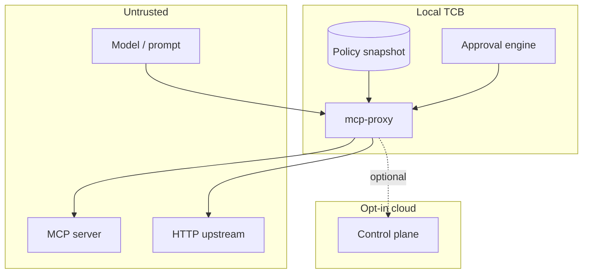

# Sqreen threat model

**Status:** living document aligned to the current codebase (`mcp-proxy`, optional `mcp-control-plane`).  
**Companion docs:** [FAILURE_MODES.md](./FAILURE_MODES.md) · [SECURITY.md](../SECURITY.md) · [OPEN_CORE_SPLIT.md](./OPEN_CORE_SPLIT.md)

This document states what Sqreen **does** protect, what it **does not**, and where the implementation has **known gaps**. Claims here must match code. If they diverge, fix the code or this doc.

---

## 1. Assets

| Asset | Why it matters |
|-------|----------------|
| Secrets on the developer machine (keys, tokens, env files) | Primary exfil target for agent tool abuse |
| Corporate / local policy YAML | Defines allow / block / confirm |
| Approval judgments | Human gate for high-risk actions |
| Device / admin tokens | Edge ↔ cloud authentication |
| Telemetry / SOC events | Investigation integrity |
| Agent tool path (MCP stdio, HTTP `serve`) | Enforcement only applies to traffic that passes through Sqreen |

## 2. Actors

| Actor | Capabilities assumed |
|-------|----------------------|
| **Confused / injected agent** | Issues arbitrary tool calls the model was persuaded to make |
| **Malicious MCP server** | Crafts tool schemas, results, and side effects once invoked |
| **Local malware / compromised IDE process** | Can edit config, disable wraps, read the same disk as the user |
| **Malicious cloud admin / compromised control plane** | Can push policy/threat-intel and receive telemetry if the edge is opted in |
| **Cross-tenant cloud attacker** | Tries to read another org’s SOC data or mint tokens |
| **Network attacker** | MITM install downloads or cloud HTTPS (TLS assumed when HTTPS is used) |

## 3. Trust boundaries

```text
┌─────────────────────────────────────────────────────────────┐
│  UNTRUSTED: model output, MCP server, tool results,         │
│             HTTP upstream bodies, agent-supplied identity   │
└───────────────────────────┬─────────────────────────────────┘
                            │ tool call / HTTP tool loop
                            ▼
┌─────────────────────────────────────────────────────────────┐
│  TRUSTED COMPUTING BASE (local): mcp-proxy process,         │
│  loaded policy snapshot, approval engine, optional hooks    │
└───────────────────────────┬─────────────────────────────────┘
                            │ optional HTTPS + device token
                            ▼
┌─────────────────────────────────────────────────────────────┐
│  SEMI-TRUSTED (opt-in cloud): control plane + SOC UI        │
│  Replica for policy/intel/telemetry — not required for      │
│  local allow/deny by default                                │
└─────────────────────────────────────────────────────────────┘
```

**Hard boundary:** enforcement decisions are made from a **local policy snapshot** inside `mcp-proxy`. The control plane is a **replica, not an oracle** (see gateway docs and [FAILURE_MODES.md](./FAILURE_MODES.md)).

**Soft boundary:** anything that never enters `mcp-proxy` (direct shell, unwrapped MCP, other IDE tools) is **outside** Sqreen’s TCB.



## 4. Local vs cloud responsibilities

| Concern | Local (`mcp-proxy`) | Cloud (optional) |
|---------|---------------------|------------------|
| Allow / deny / confirm | **Authoritative** | Not required for the decision |
| Policy authoring | YAML on disk | Can sync a remote document into local/cache |
| Threat-intel IOCs | Local file ± synced cache | Corporate feed when configured |
| Approvals | Local TTY by default; optional remote via `SQREEN_APPROVAL_MODE` | Durable `approval_requests` queue + human decide APIs; SOC may also *observe* telemetry approvals |
| Telemetry | Optional outbound signals | Store, SOC UI, SIEM export |
| Tenant isolation | N/A (single machine) | Org-scoped queries; device org from token |

**Default install:** `MCP_CONTROL_PLANE_URL` empty → **no Sqreen cloud traffic** from the runtime.

---

## 5. Fail-open / fail-closed behavior

Authoritative matrix: [FAILURE_MODES.md](./FAILURE_MODES.md) and `mcp-proxy/src/gateway/failure.rs`.

**Governing invariant:** a broken *inspecting* control must not produce a **silent plain allow**.

| Default posture (summary) | Mode |
|---------------------------|------|
| Malformed / unparseable action or policy engine error | **FAIL_CLOSED** |
| Approval unavailable / timeout | **FAIL_CLOSED** |
| DLP cannot mask after a hit | **FAIL_CLOSED** |
| Risk / threat-intel degraded | **DEGRADE_SAFELY** → approval |
| No policy file loaded yet | **FAIL_CLOSED** (default `enforcing` posture). Opt into FAIL_OPEN only with `SQREEN_ENFORCEMENT_POSTURE=development` (explicit + loud). |
| Audit sink / control plane unreachable | **FAIL_OPEN** (availability); failure recorded on the outcome |

Presets: `SQREEN_FAILURE_POLICY=default|strict|observe`.  
`observe` is **not** a security posture.

**Cloud connectivity loss:** evaluation continues on the last local/cached policy. Sync failures are logged as degraded / fail-open for the *sync* path; they do not flip denials into allows.

---

## 6. Secrets handling

| Mechanism | Behavior |
|-----------|----------|
| Policy `global.redact_keys` | Redacts named JSON keys before forward (when frame is JSON) |
| DLP / secret shape scanning | Masks common token shapes on evaluated paths |
| `gateway::sanitize_detail` | Strips secret-like material from operator/audit error text |
| Debug log | Masks secrets (must not write raw frames) |
| Telemetry privacy | Omits prompt/body/file-content style argument values; hashes ids — see `mcp-proxy/src/telemetry/privacy.rs` |

**Gaps**

- Redaction is **pattern / key based**, not a formal information-flow proof. Novel secret formats can leak.
- Non-JSON frames may not honor `redact_keys` fully (pattern masking may still apply); see failure-mode notes.
- A local attacker with filesystem access can read secrets **without** going through Sqreen.

---

## 7. Policy integrity

**What exists today**

- Policy is loaded from a path (`MCP_POLICY_PATH` or defaults), validated/compiled at load.
- Corrupt / unusable policy engine → **FAIL_CLOSED**.
- **Managed sync** returns an Ed25519-signed policy envelope; the edge verifies signature, org binding, digest, anti-rollback, then composes with an immutable mandatory baseline before activation using trust-layer provenance (priority is within-layer only; org ALLOW cannot outrank mandatory DENY). See docs/POLICY_INTEGRITY.md.
- **Default security surface** (installer seed, repo `mcp-policy.yaml`, Cursor hooks, dashboard defaults) is generated from one typed SoT — `mcp-proxy/src/security_baseline/`. See docs/SECURITY_BASELINE.md. CI fails on drift.
- **Multi-tenant isolation:** device org is derived from enrollment; `X-Org-Id` cannot retarget tenant; policies/revisions/SOC rows are org-scoped. See docs/TENANCY.md.
- **Credential bootstrap:** production refuses missing/default/fixture admin secrets; development uses ephemeral CSPRNG admin tokens (0600 file). Device tokens are hashed at rest. Telemetry `device_id` is a non-secret enrollment identity — never the bearer. See docs/CREDENTIALS.md.
- Signed cache is re-verified on use; last-known-good is kept on sync failure.
- Local YAML alone remains unsigned (host trust); composition still cannot drop the mandatory baseline when a remote document is present.

**Gaps / residual**

| ID | Gap | Risk |
|----|-----|------|
| **P1** | ~~Unsigned managed sync~~ **Mitigated** for control-plane sync | Unsigned remote bodies rejected; local YAML still host-trusted |
| **P2** | Compromised control plane **without** signing key cannot forge envelopes | Compromised **signing key** or malicious authorized publisher still can push bad-but-signed policy (key custody) |
| **P3** | Process with write access can still edit **local** YAML / disable wraps | Host compromise equals user |
| **P4** | ~~`policy_missing` defaults to FAIL_OPEN~~ **Mitigated** | Default FAIL_CLOSED under `SQREEN_ENFORCEMENT_POSTURE=enforcing`. |

Managed fleets should set `SQREEN_ORG_ID`, configure policy signing keys, use `SQREEN_FAILURE_POLICY=strict`, and restrict ACLs on the mcp-proxy config directory.

## 8. Approval security

**What exists today**

- Approvals are a first-class gateway stage (`gateway/approval`).
- Unavailable / timed-out approver → fail-closed (never a silent allow; even “open” approval posture cannot promote to plain Allow — strongest open result is still stopping `RequireApproval`).
- Grants are bound to action fingerprints; **arg tamper** and **once-grant replay** are rejected in grant-store tests.
- Session / timed grants have TTLs (local only).
- **Remote approvals** (`SQREEN_APPROVAL_MODE=remote|auto`): device creates a control-plane request; SOC operators decide via OIDC session + `approval:decide`; device consumes once with ActionBinding digest. See [REMOTE_APPROVALS.md](./REMOTE_APPROVALS.md).

**Gaps**

| ID | Gap | Risk |
|----|-----|------|
| **A1** | ~~Default human channel is local TTY only~~ Partially mitigated: remote channel shipped; default remains `local` for back-compat | Headless fleets must opt into `remote`/`auto` |
| **A2** | Approver identity is OIDC session-bound (not hardware attestation of the operator workstation) | Compromised SOC session can still decide |
| **A3** | Broad session grants can over-authorize similar tools if operators choose loose scopes | Operator foot-gun (mitigated partly by binding helpers; remote path is APPROVE_ONCE only) |

---

## 9. Event redaction & telemetry privacy

**What leaves the machine (only if cloud opted in)**

- Security **signals**: tool name, decision, risk markers, hashed identifiers, path/domain **summaries**.
- Designed **not** to ship prompts, file contents, or secret argument values (`telemetry/privacy.rs`).

**Gaps**

| ID | Gap | Risk |
|----|-----|------|
| **T1** | Privacy transforms are best-effort; new argument keys may need allow/deny list updates | Accidental sensitive field egress |
| **T2** | Hash salt defaults exist; deployments should set `SQREEN_TELEMETRY_HASH_SALT` | Cross-deployment correlation if defaults reused |
| **T3** | A stolen **device token** can inject fabricated telemetry for that org | Event poisoning (see below) |

SIEM webhook export can use optional Bearer and/or HMAC body signatures (`mcp-control-plane/sink`).

---

## 10. Tenant isolation & authentication

**Edge → cloud**

- `X-Device-Token` authenticates policy sync and telemetry ingest.
- Provisioned tokens store **hashes**; plaintext shown once at mint.
- Telemetry `org_id` / device id are taken from the **authenticated principal**, not trusted solely from the JSON body (`handlers.go`, `domain.go` comments).

**SOC / admin (humans)**

- Production: OIDC authorization-code + PKCE → HttpOnly session cookie → `organization_memberships` → RBAC (`Authorize`). See [HUMAN_AUTH.md](./HUMAN_AUTH.md).
- `X-Org-Id` is a selection hint among **server-side memberships only** (never identity establishment; no Wildcard for humans).
- Legacy shared `X-Admin-Token` is **disabled in production** and only available outside production when `SQREEN_ENABLE_LEGACY_ADMIN_AUTH=true`.

**Gaps**

| ID | Gap | Risk |
|----|-----|------|
| **I1** | ~~Shared admin bearer~~ **Mitigated** for production humans (OIDC+session+RBAC) | Residual: legacy token in non-prod if explicitly enabled; stolen session cookie until expiry/revocation |
| **I2** | ~~`X-Org-Id` grants org without membership~~ **Mitigated** for humans | Hint mismatch → 403; membership re-checked each request |
| **I3** | Env-configured legacy device token lists still exist for bootstrap | Mis-set production env tokens |
| **I4** | No mTLS between edge and control plane in the default design | Token bearer security over TLS only |

---

## 11. Update mechanism

**What exists today**

- `install.sh` downloads prebuilt binaries from `sqreen.ai/releases` (and GitHub fallbacks) or builds from source.
- Version tags / GitHub Actions publish release assets **plus** an Ed25519-signed `release-manifest.json` (SHA-256 digests). The installer verifies signature + digest before install. See [RELEASE_INTEGRITY.md](./RELEASE_INTEGRITY.md).

**Gaps**

| ID | Gap | Risk |
|----|-----|------|
| **U1** | ~~Installer does not verify checksums/signatures~~ **Mitigated** | Prebuilt installs verify Ed25519-signed `release-manifest.json` + SHA-256 before install. See [RELEASE_INTEGRITY.md](./RELEASE_INTEGRITY.md). Remaining: `curl\|bash` trusts the installer script host; source-build fallback is unsigned. |
| **U2** | Auto-update of a running edge binary is **not** a hardened attested channel | Operators must treat updates as trust-on-first-use unless they verify manually |

---

## 12. Supported attack scenarios (mitigations that exist)

These are scenarios where Sqreen **materially helps** when traffic goes through the proxy/hooks and policy is present.

| Scenario | Mitigation (current) | Residual risk |
|----------|----------------------|---------------|
| **Prompt injection → tool abuse** | Policy block/confirm on tool name + arg patterns; risk gate; optional approval | Model still *requests*; enforcement is on the call. Unwrapped tools bypass. |
| **Credential / private-key path exfil via tools** | Global / tool `block_patterns`; demo + default seeds; Cursor hooks (defense in depth) | Pattern evasion; alternate tools; hooks disabled |
| **Path traversal in tool args** | Patterns for `../..` style traversal in default policy; fail-closed on unparseable payloads | Encoding tricks may need ongoing pattern work |
| **Dangerous command execution** | `Confirm` / block patterns on shell-like tools; approval timeouts deny | Only tools that pass through Sqreen; pattern coverage incomplete by nature |
| **Approval grant replay / arg tamper** | Grant store binding + tests rejecting replay/tamper | Host-local approver compromise |
| **Loss of cloud connectivity** | Local evaluation continues; sync fail-open; audit failure recorded | Stale remote policy until reconnect (by design) |
| **Malformed MCP / HTTP frames** | Normalization fail-closed; JSON-RPC errors instead of silent forward | — |
| **Cross-tenant SOC read (device data)** | Org from device token; isolation tests | Admin-token model still broad |

---

## 13. Explicitly unsupported / out of scope (today)

Marking these clearly so they are not sold as product properties:

| Scenario | Status |
|----------|--------|
| Stopping a **malicious MCP server** from lying in **tool results** or attacking the **host once allowed to run** | **Unsupported** as primary control. Sqreen gates *invocation*; a permitted server still runs with its own privileges. Response DLP helps some secret shapes only. |
| Preventing abuse when the agent **bypasses** the proxy (unwrapped MCP, raw shell, other IDE features) | **Unsupported** without additional OS / IDE controls |
| Cryptographic **agent identity** / non-impersonable agent attestation | **Gap** — identity is ambient / env / adapter-filled, not hardware- or IdP-bound |
| **Policy tampering** detection (signed policy) | **Mitigated** for managed sync — P1/P2; local YAML still P3 |
| Guaranteeing integrity of **install/update** binaries | **Gap** — U1 |
| Stopping a **fully compromised developer workstation** | **Unsupported** — attacker equals user |
| Model-provider account takeover, prompt leakage to the LLM vendor, or cloud LLM logging | **Out of scope** |
| Guaranteeing SIEM delivery | **Unsupported** — SIEM export is **fail-open** by design |
| Formal verification / perfect DLP | **Unsupported** |

---

## 14. Threat scenarios (requested set)

### Malicious MCP servers

- **Protected:** tool *calls* can be blocked/confirmed before invoke; some response redaction.
- **Not protected:** server behavior after allow; supply-chain of the MCP package itself.
- **Gap:** treat MCP servers as untrusted code execution when allowed.

### Prompt injection causing tool abuse

- **Protected:** runtime policy on the resulting tool call.
- **Not protected:** injection into the model context itself; social-engineering the human approver.

### Credential exfiltration

- **Protected:** path/pattern policy, DLP masking, hooks (optional layer).
- **Gap:** novel channels (encoding, chunking, non-filesystem tools) need continuous policy work.

### Path traversal

- **Protected:** default traversal-oriented patterns; unparseable args denied.
- **Gap:** exotic encodings — track as ongoing detection debt.

### Command execution

- **Protected:** confirm/block rules for configured shell tools; approval fail-closed.
- **Gap:** only for wrapped tools; without a policy under `enforcing`/`managed`, tool execution is denied (`policy_unavailable`) rather than fail-open.

### Approval bypass

- **Protected:** unavailable approver does not allow; grant replay/tamper checks.
- **Gap:** A1–A2 (host/TTY trust); disabling proxy entirely.

### Policy tampering

- **Mitigated (managed):** signed envelopes + cache re-verify + mandatory baseline. **Residual:** local YAML / host compromise (P3).

### Event poisoning

- **Partial:** org/device forced from device principal on ingest; body size capped.
- **Gap:** T3 — valid stolen device token can still spam or fabricate events for **that** org; no anomaly quotas beyond device-token limits.

### Agent impersonation

- **Gap:** agent ids are not strongly authenticated; labels can be spoofed in ambient identity.

### Replay attacks

- **Partial:** approval **grants** resist replay; HTTP/MCP request replay at the transport layer is **not** a general anti-replay protocol.
- **Gap:** no global nonce store for all tool calls.

### Compromised cloud control plane

- **Local-first:** edge can keep enforcing last-known local policy if sync fails.
- **Mitigated (policy):** sync success without the policy signing key cannot activate attacker-modified policy. Residual: stolen signing key; threat-intel still unsigned.

### Loss of cloud connectivity

- **Supported:** decisions remain local; telemetry/audit may fail-open with reasons recorded.
- **Residual:** no central visibility until reconnect; remote policy updates delayed.

---

## 15. Responsible disclosure

Follow **[SECURITY.md](../SECURITY.md)**.

- Email **security@sqreen.ai**
- Do **not** open public issues for vulnerabilities
- Acknowledge target: **3 business days**; remediation timeline target: **14 days** for confirmed issues
- Safe harbor for good-faith research as described there

---

## 16. High-risk gaps — actionable TODOs

Prioritized for engineering. Status should move to issues/PRs when work starts.

### P0 / P1 — treat as near-term security backlog

- [x] **SEC-TODO-1 (U1):** Release artifacts carry SHA-256 digests in an **Ed25519-signed** `release-manifest.json`; `install.sh` verifies before install. See [RELEASE_INTEGRITY.md](./RELEASE_INTEGRITY.md).
- [x] **SEC-TODO-13:** Air-gapped / checksum-verified install notes live in [RELEASE_INTEGRITY.md](./RELEASE_INTEGRITY.md) (pin version, verify signature offline with OpenSSL 3 + embedded public key).
- [x] **SEC-TODO-2 (P1/P2):** Signed policy envelopes (Ed25519): control plane signs; edge verifies before activate; unsigned remote rejected (non-prod opt-in `SQREEN_ALLOW_UNSIGNED_POLICY` only). See docs/POLICY_INTEGRITY.md.
- [x] **SEC-TODO-3 (P4):** Default `policy_missing` is FAIL_CLOSED under `SQREEN_ENFORCEMENT_POSTURE=enforcing` (installer default). Managed posture also fail-closed; development is the conscious FAIL_OPEN opt-in.
- [ ] **SEC-TODO-4 (T3):** Rate-limit / anomaly-detect telemetry ingest per device token; alert on volume spikes (event poisoning).
- [x] **SEC-TODO-5 (I1):** Replace shared `X-Admin-Token` with **OIDC / SSO** + server sessions + org membership + RBAC for SOC admin APIs. See [HUMAN_AUTH.md](./HUMAN_AUTH.md). Legacy admin token is non-production-only behind `SQREEN_ENABLE_LEGACY_ADMIN_AUTH`.

### P2 — important hardening

- [x] **SEC-TODO-6 (A1/A2):** Pluggable **remote approval** channel — control plane `approval_requests` + device create/poll/consume + dashboard queue + OIDC/RBAC decide. Default mode remains local TTY; set `SQREEN_APPROVAL_MODE=remote|auto`. See [REMOTE_APPROVALS.md](./REMOTE_APPROVALS.md).
- [ ] **SEC-TODO-7:** File integrity watch on policy path (mtime/hash log + optional deny on unexpected change).
- [x] **SEC-TODO-8:** Agent execution identity: device-authenticated attribution + registered agent↔device bindings; self-asserted labels cannot grant privilege. See [EXECUTION_IDENTITY.md](./EXECUTION_IDENTITY.md). (Not hardware/workload attestation.)
- [ ] **SEC-TODO-9 (T1/T2):** Require non-default `SQREEN_TELEMETRY_HASH_SALT` when cloud URL is set; CI check for new sensitive argument keys.
- [ ] **SEC-TODO-10:** Response-path policy for MCP tool **results** (not only requests) for high-risk servers.

### P3 — defense in depth / documentation

- [ ] **SEC-TODO-11:** Publish a short “**what Sqreen does not do**” card on the public site linking here.
- [x] **SEC-TODO-12:** Policy integrity + adversarial tests reject forged/replayed/wrong-org envelopes (`mcp-proxy/src/policy/integrity_tests.rs`).

---

## 17. Operator checklist (minimum viable hardening)

1. Ensure every IDE MCP server is **wrapped** by `mcp-proxy` (or equivalent adapter path).
2. Keep a non-empty policy; for fleets use `SQREEN_FAILURE_POLICY=strict`, set `SQREEN_ORG_ID`, and configure control-plane policy signing keys (docs/POLICY_INTEGRITY.md).
3. Restrict write ACLs on `~/.config/mcp-proxy/`.
4. Leave cloud URL empty unless you intend to send signals; rotate device tokens.
5. Prefer installing from a reviewed git tag, or verify `install.sh` out-of-band, when you need assurance beyond `curl | bash` (see [RELEASE_INTEGRITY.md](./RELEASE_INTEGRITY.md)).
6. Treat MCP servers you allow as **code you trust to run**.
